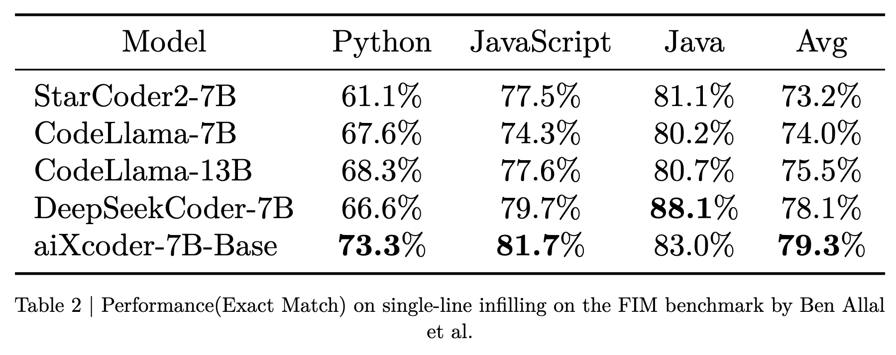
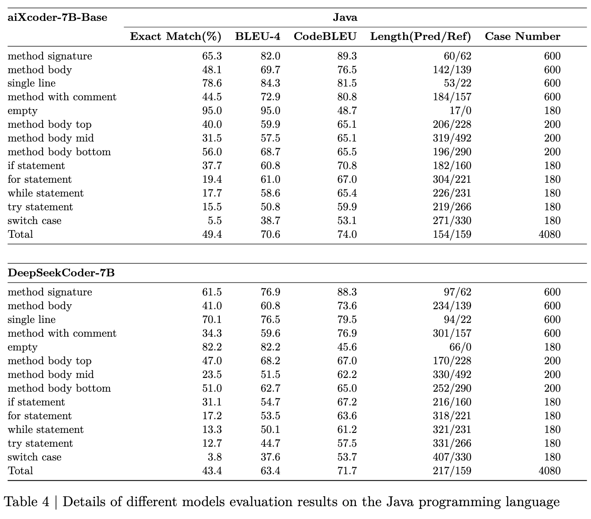
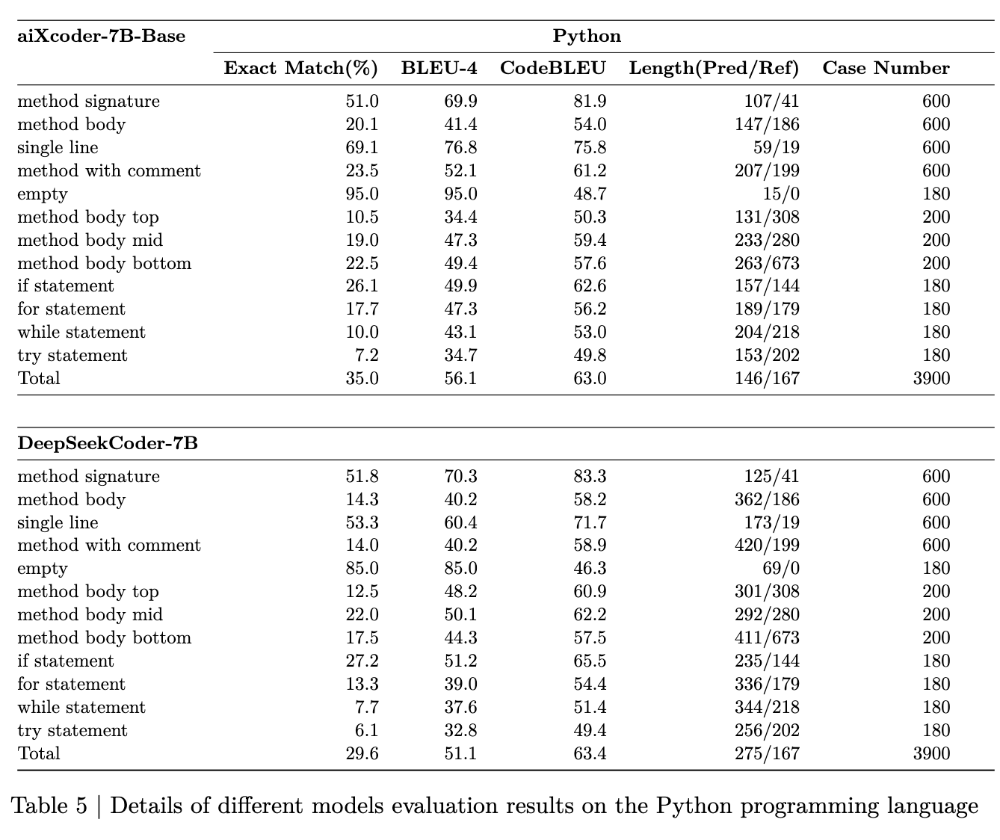

# aiXcoder-7B Code Large Language Model

<p align="center">
    🏠 <a href="https://www.aixcoder.com/" target="_blank">官网</a>｜🛠 <a href="https://marketplace.visualstudio.com/items?itemName=aixcoder-plugin.aixcoder" target="_blank">VS Code 插件</a>｜🛠 <a href="https://plugins.jetbrains.com/plugin/13574-aixcoder-code-completer" target="_blank">Jetbrains 插件</a>｜🤗 <a href="https://huggingface.co/aiXcoder/aixcoder-7b-base" target="_blank">模型下载</a>｜<a href="./assets/wechat_1.jpg" target="_blank">技术交流群</a>｜<a href="./assets/wechat_2.jpg" target="_blank">公众号</a>
</p>

欢迎来到aiXcoder-7B代码大型语言模型的官方仓库。该模型旨在理解和生成多种编程语言中的代码，提供在代码完成、理解、生成以及更多关于编程语言的任务中的最先进性能。

目录

1. [模型简介](#模型简介)
2. [快速上手](#快速上手)
    - [运行环境](#运行环境)
    - [模型权重](#模型权重)
    - [推理示例](#推理示例)
3. [aiXcoder 7B 训练数据](#aixcoder-7b-训练数据)
4. [训练](#训练)
    - [训练超参数](#训练超参数)
    <!-- - [批量数据组织方式](#批量数据组织方式)
    - [预训练任务](#预训练任务) -->
5. [实验结果](#实验结果)
    - [NL2Code 基准测试](#nl2code-基准测试)
    - [代码补全 (Fill in the Middle)](#代码补全-fill-in-the-middle)
    - [跨文件代码生成](#跨文件代码生成)
6. [License](#license)
7. [Acknowledgments](#acknowledgments)


## 模型简介

随着代码大模型的能力逐渐被挖掘出来，aiXcoder 也一直在思考怎样才能令代码大模型在实际开发场景中有更大的帮助。为此，我们开源了 aiXcoder 7B Base，该模型在1.2T Unique Tokens上做了大量的训练，并且该模型的预训练任务及上下文信息都为真实代码生成场景做了独特的设计。 

aiXcoder 7B Base 在代码补全场景下是所有同等级参数量模型中效果最好的，主流多语言nl2code benchmark 平均上效果也超过codellama 34B 和StarCoder2 15B。

在我们持续推动代码大模型应用的探索过程中，aiXcoder 7B Base 模型的发布标志着一个重要的里程碑。当前版本的 aiXcoder 7B Base 是一个基础模型，专注于提升代码补全和代码生成的效率与准确性，旨在为开发人员在这些场景下提供强有力的支持。值得注意的是，这个版本尚未经过特别的instruct微调，意味着它在特定的高级任务如测试用例生成和代码调试方面可能还未达到最优表现。

然而，我们已经在规划中包含了对aiXcoder模型系列的进一步发展。在不久的将来，我们计划发布新的模型版本，这些版本将经过精心的Instruct微调，专门针对更广泛的编程任务，包括但不限于测试用例生成和代码调试。通过这些经过Instruct微调的模型，我们期待能够为开发者提供更全面、更深入的编程支持，帮助他们在软件开发的每一个阶段都能发挥出最大的效率。


> aiXcoder 7B surpasses mainstream models in nl2code benchmark. aiXcoder-7B is an enhancement of aiXcoder-7B-Base, fine-tuned on one hundred thousand data entries similar to Evol-instruct for one epoch.

<br>
<br>


> aiXcoder 7B Base surpasses mainstream models in code completion scenarios. 

<br>
<br>

## 快速上手

### 运行环境

#### 选择一：构建一个运行环境

主要的环境依赖为：

- Python 3.8 or higher
- PyTorch 2.1.0 or higher
- sentencepiece 0.2.0 or higher
- transformers 4.34.1 or higher (if run inference by transformers library)

在支持CUDA环境的宿主机或者容器内，执行以下命令安装环境依赖项：

```bash
conda create -n aixcoder-7b python=3.11
conda activate aixcoder-7b
git clone git@github.com:aixcoder-plugin/aiXcoder-7b.git
cd aiXcoder-7b
pip install -r requirements.txt
```

`requirements.txt` 列举了所有的依赖项及其版本号。

如果想要加快推理速度，我们强烈建议安装 FlashAttention 库（可选）。在确定您的芯片版本与CUDA版本支持FlashAttention 的条件下，可通过以下步骤进行安装：

```bash
git clone git@github.com:Dao-AILab/flash-attention.git
cd flash-attention
MAX_JOBS=8 python setup.py install
```

#### Option 2: Docker

为了更好地隔离开发环境，我们建议您可以在 Docker 容器内运行模型推理。如下是启动准备 docker 环境的步骤：

1. 安装 Docker：如果您的机器还没有安装Docker，您可以参考官方的安装步骤安装。

2. 拉取镜像: 从 Docker Hub 拉取 PyTorch 镜像。

```bash
docker pull pytorch/pytorch:2.1.0-cuda11.8-cudnn8-devel
```

3. 启动容器: 拉取docker 镜像后，可以启动容器，并在容器中运行模型。

```bash
docker run --gpus all -it -v /dev/shm:/dev/shm --name aix_instance pytorch/pytorch:2.1.0-cuda11.8-cudnn8-devel /bin/bash
pip install sentencepiece
git clone git@github.com:aixcoder-plugin/aiXcoder-7b.git
cd aiXcoder-7b
```

如果想要加快推理速度，我们强烈建议安装 FlashAttention 库（可选）。在确定您的芯片版本与CUDA版本支持FlashAttention 的条件下，可通过以下步骤进行安装：

```bash
git clone git@github.com:Dao-AILab/flash-attention.git
cd flash-attention
MAX_JOBS=8 python setup.py install
```

4. 模型推理: 在容器内，您可以安装推理示例代码进行预测。


### 模型权重

您能从以下地址下载模型：

- [aiXcoder Base Download](https://huggingface.co/aiXcoder/aixcoder-7b-base)
- aiXcoder Instruct Download (Comming soon...)

### 推理示例

#### 命令行执行

如果需要快速执行，只需要通过以下命令行即可运行推理样本:

```bash
torchrun --nproc_per_node 1 sess_megatron.py --model-dir "path/to/model_weights_dir"
```

将 "path/to/model_weights_dir" 替换为您下载模型权重后的本地地址。

或者通过 huggingface 的 transformers 库进行推理测试：

```bash
python sess_huggingface.py
```

#### Python 脚本

如果您想嵌入自己的工具流，或者获得更灵活的使用方式，您能通过以下代码直接调用：

```python

from sess_megatron import TestInference

infer = TestInference()
res = infer.run_infer(
    # for FIM style input, code_string stands for prefix context
    code_string="""# 快速排序算法""", 
    # for FIM style input, later_code stands for suffix context
    later_code="\n",
    # file_path should be a path from project to file
    file_path="test.py",
    # max num for generated tokens
    max_new_tokens=256,
)
print(res)

"""output:

def quick_sort(arr):
    if len(arr) <= 1:
        return arr
    pivot = arr[0]
    less = [i for i in arr[1:] if i <= pivot]
    greater = [i for i in arr[1:] if i > pivot]
    return quick_sort(less) + [pivot] + quick_sort(greater)


# 测试
arr = [3, 2, 1, 4, 5]
print(quick_sort(arr))  # [1, 2, 3, 4, 5]
"""

```


```python

import torch
import sys
from hf_mini.utils import input_wrapper
from transformers import AutoModelForCausalLM, AutoTokenizer

device = "cuda" # the device to load the model onto

tokenizer = AutoTokenizer.from_pretrained("aiXcoder/aixcoder-7b-base")
model = AutoModelForCausalLM.from_pretrained("aiXcoder/aixcoder-7b-base", torch_dtype=torch.bfloat16)


text = input_wrapper(
    # for FIM style input, code_string stands for prefix context
    code_string="# 快速排序算法",
    # for FIM style input, later_code stands for suffix context
    later_code="\n# 测试\narr = [3, 2, 1, 4, 5]\nprint(quick_sort(arr))  # [1, 2, 3, 4, 5]",
    # file_path should be a path from project to file
    path="test.py"
)

if len(text) == 0:
    sys.exit()

inputs = tokenizer(text, return_tensors="pt", return_token_type_ids=False)

inputs = inputs.to(device)
model.to(device)

outputs = model.generate(**inputs, max_new_tokens=256)
print(tokenizer.decode(outputs[0], skip_special_tokens=False))


"""output:
def quick_sort(arr):
    # 如果数组长度小于等于1，直接返回
    if len(arr) <= 1:
        return arr
    # 选择数组的第一个元素作为基准
    pivot = arr[0]
    # 初始化左右指针
    left, right = 1, len(arr) - 1
    # 循环直到左指针小于右指针
    while left < right:
        # 从右到左找到第一个小于基准的元素，与左指针元素交换
        if arr[right] < pivot:
            arr[left], arr[right] = arr[right], arr[left]
            left += 1
        # 从左到右找到第一个大于等于基准的元素，与右指针元素交换
        if arr[left] >= pivot:
            right -= 1
    # 将基准元素与左指针元素交换
    arr[left], arr[0] = arr[0], arr[left]
    # 对左半部分进行递归排序
    quick_sort(arr[:left])
    # 对右半部分进行递归排序
    quick_sort(arr[left + 1:])
    return arr</s>
"""

```

## aiXcoder 7B 训练数据

aiXcoder 的数据分为核心数据集与扩展数据集，核心数据集由业务上常用的几大编程语言，以及与代码息息相关的自然语言组成。核心数据集的编程语言主要有 C++、Python、Java、JavaScript等近百种主流编程语言，自然语言上主要由 StackOverFlow 问答、技术博客、代码文档、计算机领域论文等组成。扩展数据集主要由过滤后的代码开源数据集，英文自然语言高质量数据集，中文自然语言高质量数据集组成。

<!-- <br>
<br>


<br>
<br> -->


aiXcoder 核心数据集主要用于强化代码大模型在以上编程语言上的效果，其经过大量的过滤与筛选过程。具体而言主要分为如下几步：1) 原始数据挑选； 2) 对项目进行综合排序，并筛选；3) 基于 MinHashes(Broder, 2000) 等方法进行代码去重、去除自动生成的代码；4) 个人敏感信息识别与处理；5) 清理被注释的代码；6) 语法分析过滤不正确或者异常的代码文件；7）结合静态分析工具，检测并排除 Java\CPP\Python\JS 等主流编程语言中高风险的163 种 bug 和197 种缺陷。

1. 原始数据挑选
    - 排除 copyleft licenses 项目
    - 对 aiXcoder 在各大代码托管平台上抓取的数据及开源数据做项目去重
2. 项目级的综合排序
    - 统计项目的Star量、Git Commit 数量、Test文件数量，并综合评分
    - 排除综合评分最低的10%数据
3. 代码文件级筛选
    - 删除自动生成代码
    - near-deduplication去重
4. 敏感信息去除
    - 命名实体模型识别并删除人名、IP、账号密码、网址等敏感信息
5. 被注释的代码
    - 按比例随机删除被注释的大段代码
6. 语法分析
    - 删除主流数十种语言存在语法解析错误或者语法错误的代码
7. 静态分析
    - 结合静态分析工具，扫描并定位影响代码可靠性和可维护性的161种Bug，影响代码安全性的197种漏洞

```python
# "__init__" method should not return a value

# Noncompliant: a TypeError will be raised
class MyClass(object):
    def __init__(self):
        self.message = 'HelloWorld'
        return self  

# Compliant solution
class MyClass(object):
    def __init__(self):
        self.message = 'HelloWorld'
```

上述代码展示了python中的一种bug模式，即 __init__  方法不应该返回值。

## 训练

### 训练超参数

分词器:
- 基于字节码的 BPE 分词器
- 词表大小：49,152

模型结构:
- RoPE (Rotary Positional Embedding) 相对位置编码
- 中间全连接层采用 SwiGLU
- Grouped Query Attention

训练配置:
- 70% 为结构化 FIM (Fill in the middle)训练任务，30% 为自回归语言模型任务；
- BFloat 16 数据类型
- AdamW 优化器，学习率最大1e-5，最小 1e-6，采用余弦衰减
- 预训练长度为 32,768


## 实验结果

### NL2Code 基准测试

表1 展示了 aiXcoder-7B Base 模型在独立方法生成基准上的表现，我们的模型在各大预训练基础模型中表现很好，在百亿级参数量下拥有当前最好的效果。


### 代码补全 (Fill in the Middle)

与 Table 1 的 Stand alone nl2code 不同，在实际编程场景中，我们更需要考虑光标上下文的代码补全能力。一般而言，各种开源代码大模型都会考虑在预训练中加入Fill in the middle(FIM) 模式，来强化模型在考虑代码上下文的场景下生成更准确的结果。为此，我们将以FIM为默认代码补全方式，评测各个模型在实际编程场景中的能力。

当前考虑上下文的代码补全，主流评测集是 Santacoder(Ben Allal et al., 2023) 提出来的单行评测方法。该评测集会从HumanEval 或者 MultiPL-E 中抽取的单行代码，然后在给定完整的上文与下文条件下，评估模型生成结果的Exact Match指标。




为了进一步精细地评测代码大模型在代码补全上的能力，aiXcoder 构建了一个数据量更大，被测代码多样性更高、被测代码上下文长度更长、更接近实际开发项目的评测集，该评测集也将同步在GitHub上开源。在评估过程中，我们保证不同代码大模型之间采用相同的16K最大序列长度，并且评估不同场景下的生成效果，例如生成完整方法块、条件判断块、循环处理块、异常捕捉块等十三种情况。

Table 3 展示了不同模型在不同语言上的平均生成效果，最终的评估结果是所有补全场景与评测样本的均值。aiXcoder 7B Base 模型在各大编程语言，各种评估标准下都是效果最好的，这表明aiXcoder 7B Base 在最基础的代码补全能力上是所有同量级开源模型最好的，最适合用于实际编程场景中提供代码补全能力的基础模型。


对于 Table 3 中每一条评测结果，其都有更为详细的评测维度。Table 4 到 7  展示了不同模型在不同语言上多维度评估的细节：

- **Method signature**: 表示模型根据上下文生成方法签名；
- **Method body**: 表示模型根据上下文，包括函数签名，生成完整的方法体；
- **Single line**: 表示单行代码补全；
- **Method with comment**: 表示根据上下文，包括函数签名与函数注释，生成对应的函数体；
- **Empty**: 表示在上下文完整的情况下，模型需要预测为空；
- **Method body top, mid, bottom**: 表示分别在函数体上半部分，函数体中间部分，函数体下半部分的代码生成效果；
- **If, for, while, try, switch statement**: 表示生成条件代码块、循环代码块、异常捕捉代码块、条件分支代码块的效果;






### 跨文件代码生成

代码大模型另一个比较重要的能力是跨文件的代码上下文理解能力，因为开发者在实际编写项目中，经常需要考虑当前项目其它文件内的信息。因此我们采用了CrossCodeEval (Ding et al., 2023)评测集，来评估模型提取跨文件上下文信息的能力。

在 Table 8 中，首先作为 Baseline，在单文件的情况下评测各代码大模型的生成能力。然后在 BM25 为相似性指标的情况下，通过上文搜索项目内相似的代码并作为prompt，再次评估模型的生成效果。最后，w/Ref. 表示假设我们知道正确的References 代码是什么样的，然后通过 References 搜索项目内相似的代码作为prompt，再次评估模型的生成效果。最终 aiXcoder-7B 模型在所有语言上的效果都是很好的，这证明了我们模型在提取上下文信息上，尤其是跨文件的上下文信息的能力。


## License


The source code in this repository is licensed under the [Apache-2.0](https://www.apache.org/licenses/LICENSE-2.0) License - see the LICENSE file for details. 
The model weights are licensed under the [Model License](./MODEL_LICENSE) for academic research use; for commercial use, please apply by sending an email to support@aixcoder.com.


## Acknowledgments

We would like to thank all contributors to the open-source projects and datasets that made this work possible.

For any questions or issues, please open an issue on this repository.

Thank you for your interest in our Code Large Language Model. We look forward to your contributions and feedback!